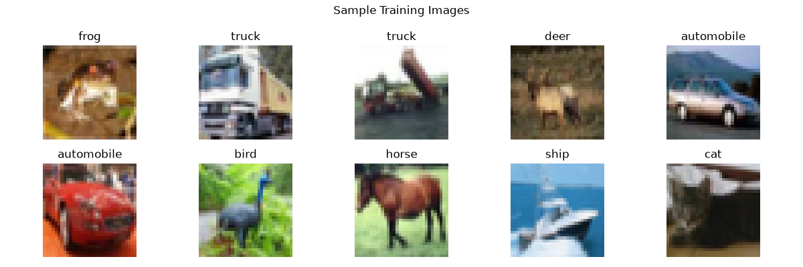
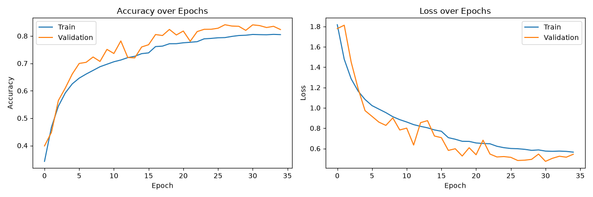
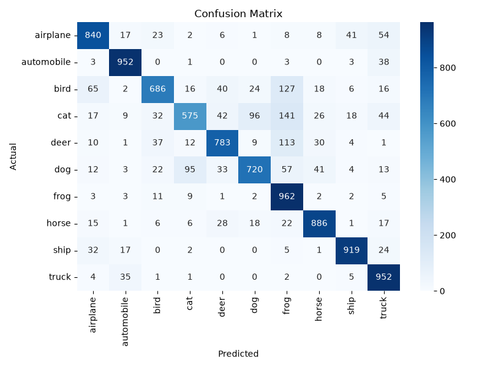
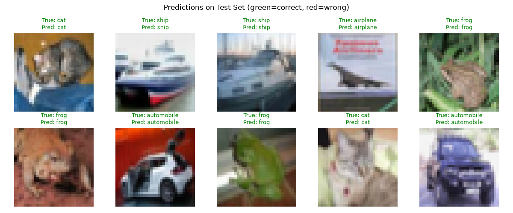

# CNN Image Classification — CIFAR-10

A Convolutional Neural Network built with TensorFlow/Keras to classify images into 10 categories using the CIFAR-10 dataset.

## 📌 Overview

This project implements an image classification pipeline from scratch, covering data preprocessing, CNN architecture design, training with regularization techniques, and thorough model evaluation.

- **Dataset:** [CIFAR-10](https://www.cs.toronto.edu/~kriz/cifar.html) — 60,000 32x32 color images across 10 classes
- **Framework:** TensorFlow / Keras
- **Test Accuracy:** ~80–85%

## 🗂️ Classes

`airplane`, `automobile`, `bird`, `cat`, `deer`, `dog`, `frog`, `horse`, `ship`, `truck`

## 🏗️ Architecture

- 3 convolutional blocks (32 → 64 → 128 filters), each with:
  - Conv2D + Batch Normalization + MaxPooling + Dropout
- Dense classifier head with Dropout
- Softmax output layer (10 classes)

**Techniques used:**
- Pixel normalization
- Data augmentation (rotation, shift, flip, zoom)
- Batch normalization
- Dropout regularization
- Early stopping & learning rate reduction on plateau

## 📊 Results

| Metric | Value |
|---|---|
| Test Accuracy | ~80-85% |
| Test Loss | See training curves below |

### Sample Training Images


### Training & Validation Curves


### Confusion Matrix


### Sample Predictions


## 🚀 How to Run

```bash
# Clone the repo
git clone https://github.com/iakshatt/Capstone-Project.git
cd Capstone-Project

# Install dependencies
pip install -r requirements.txt

# Run the script
python cnn_image_classification.py
```

## 📁 Project Structure

```
.
├── cnn_image_classification.py   # Main training/evaluation script
├── requirements.txt               # Python dependencies
├── README.md                      # Project documentation
├── sample_images.png              # Generated: sample dataset images
├── training_curves.png            # Generated: accuracy/loss curves
├── confusion_matrix.png           # Generated: confusion matrix
└── sample_predictions.png         # Generated: example predictions
```

## 🔮 Future Improvements

- Transfer learning with a pretrained model (e.g., MobileNetV2) for higher accuracy
- Hyperparameter tuning (learning rate, filter sizes, architecture depth)
- Deploy as a web app for live image classification

## 📄 License

This project is open source and available under the [MIT License](LICENSE).
